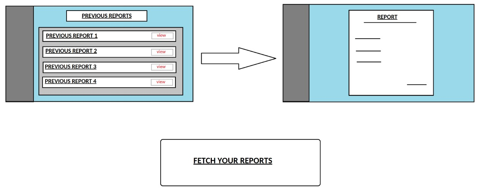
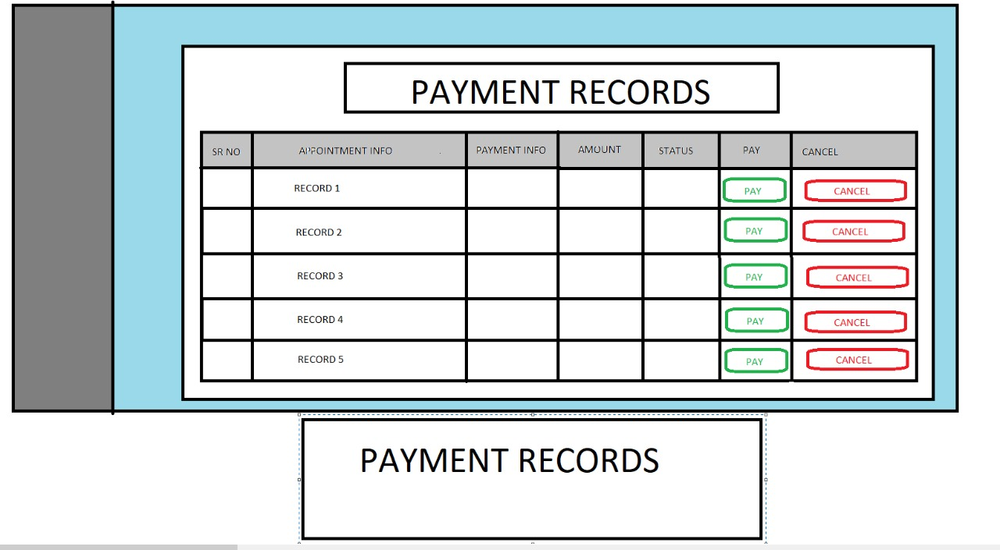
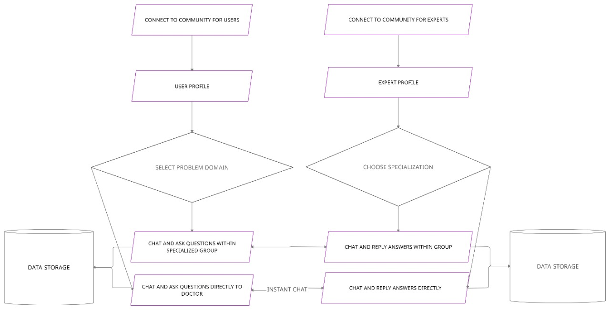
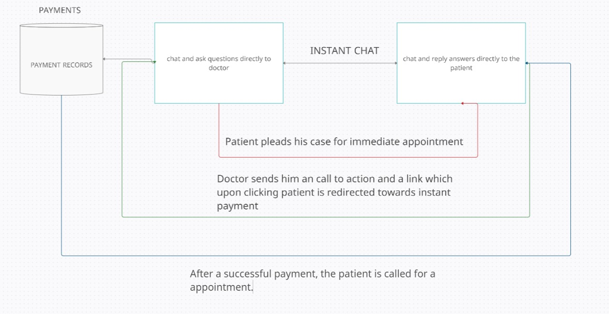
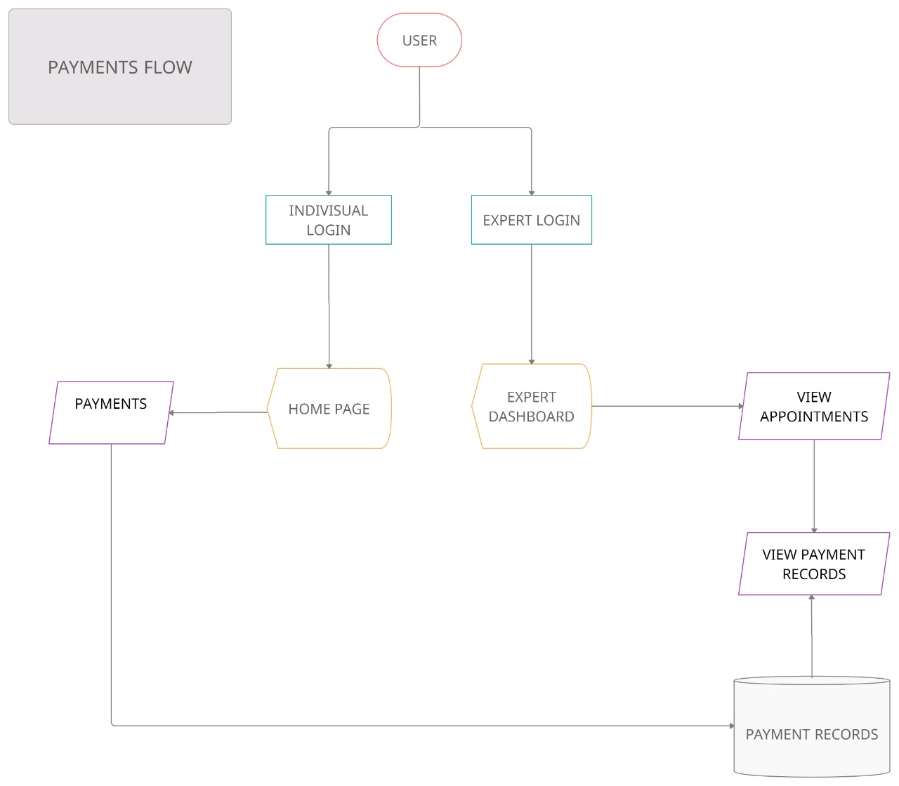
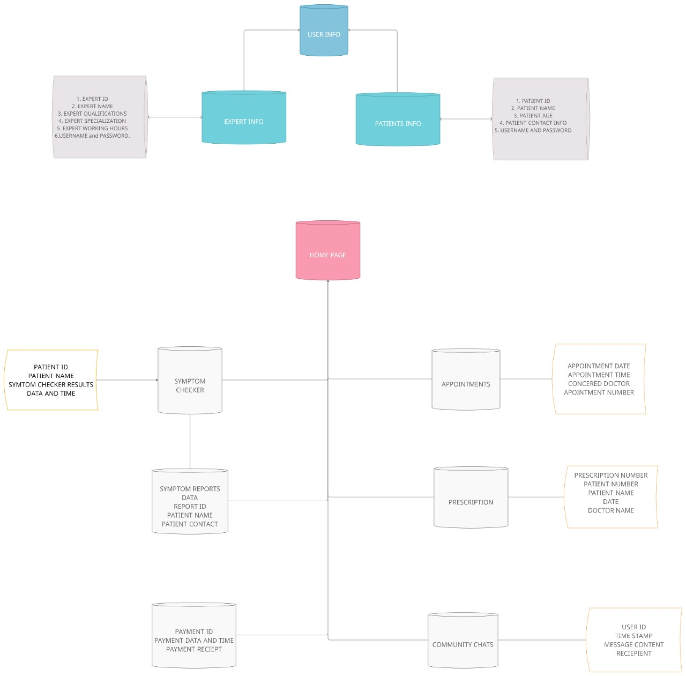

<h1 align="center">ONE TO DOC</h1>

**One To Doc** is a **healthcare management application** in which users can enter into the application and
**set appointments** with **healthcare experts** for advices and checkups.
The application has its main utilities in a single dynamic page for ease of access. The application has a
**symptom checker** and **report generation** mechanism where the user can **pre-empt his/her symptoms** and
get a **report** generated on the same. The user can then use this report to **book an appointment** and
get the appropriate care. This will help the doctors getting a better understanding of the users and
helping them in a much more cohesive way, increasing speed and efficiency. The application also
provides the utility of **getting prescriptions** and **payments in a single platform** where he/she can
check both his/her previous and current prescriptions and can manage payments, thus creating a
**fully independent self-health solution**.
The application also has a feature where a user can get into a **community with other users** and
**healthcare experts** for instant **appointments**, **chats**, and **payments**. This will help in creating a larger platform for **healthcare solutions** and **better response times**.

### How is our Solution Different

Our application , apart from being a **fully independent application**, has an edge
over other solutions in the following ways:-

1. Creation of a **fully functional community** of people ready to help each other anytime.
2. **Generation of reports** which can be used for getting further medical attention
both within the application and beyond.
3. **Generation of reports** and **pre-emption of symptoms** helps in generating a more
clear picture in the mind of the expert and can help him in giving better advices to
users.
4. **Advanced Queue Management**
5. **Review System for doctors**

### Future possible enhancements

1. **Multi Language support** for ease of use for the users.
2. **Creation of a mobile application** for the same to get better user coverage.
3. Introduction of **Use-Reward system** for attracting more users
towards the application.
4. Fully converting the application into **MERN**.

### Risks/Challenges/Dependencies

1. **Data security** of the users and the experts is a challenge as we need to
constantly evolve to handle more difficult threats such as **cross site scripting** and
**forgery**.
2. **Verification** of both experts and users is a must for protecting patient
confidentiality.

### Designs and MockUps

### Flowcharts

## Team Members

1. Pranjal Srivastava - [LinkedIn](https://www.linkedin.com/in/pranjal-srivastava-801a9a152/) [GitHub](https://github.com/pranjals149)
2. Ramankur Goswami - [LinkedIn](https://www.linkedin.com/in/ramankurgoswami/) [GitHub](https://github.com/RamankurGoswami)
3. Shivam Purohit - [LinkedIn](https://www.linkedin.com/in/shivam-purohit-0930381aa/) [GitHub](https://github.com/ShivamPurohit)
